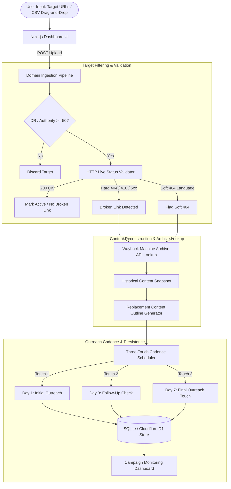

# vBB — Automated Broken Link Building Suite Architecture & Guide

> **Smarketers Off-Page Suite** — Local-first Next.js application that ingests target domains, filters for DR/DA 50+ authority, performs HTTP 404/410 validation, fetches Wayback Machine archives to reconstruct replacement content, and manages a three-touch seven-day outreach sequence.

---

## 🏗️ System Architecture Overview



---

## 🔍 Validation Engine & Archive Reconstruction

### 1. HTTP Link Validation Engine
vBB inspects submitted links through strict network checks:
- **Hard 404/410 Status**: Detects dead pages explicitly reported by target servers.
- **Server Faults (5xx)**: Detects persistent server-side timeouts and unreachable targets.
- **Soft 404 Analysis**: Inspects response body text for phrases like *"page not found"*, *"resource moved"*, and *"article archived"* to detect fake 200 OK statuses.

### 2. Wayback Machine Reconstruction API
For every validated broken link, vBB fetches historical snapshots via the public Internet Archive Availability API (`http://archive.org/wayback/available?url=...`):
- Reconstructs original article titles, main subheadings, and core target topics.
- Generates a tailored **Replacement Content Outline** that modernizes the lost resource.

### 3. Three-Touch Automated Cadence (Day 1, 3, 7)
Outreach targets progress through a scheduled 7-day lifecycle:
- **Day 1**: Initial broken link notification featuring the dead resource URL and your replacement resource.
- **Day 3**: Soft reminder highlighting a specific data point or takeaway from your replacement content.
- **Day 7**: Final follow-up before auto-archiving the lead.

---

## 💾 Persistence & Scalability

- **Local Storage Engine**: Persists campaigns, validated targets, reconstructed outlines, and outreach steps in a local SQLite file (or Cloudflare D1).
- **Horizontal Worker Option**: Includes an optional BullMQ + Redis queue setup for scaling validation and crawling jobs outside the Next.js process.

---

## 📊 Tech Stack

- **Framework**: Next.js (App Router), React 19, TypeScript
- **Styling**: Tailwind CSS, shadcn-style components, Lucide Icons, Framer Motion
- **Database**: SQLite / Cloudflare D1
- **Scaling**: Optional BullMQ + Redis worker support

---

## 🚀 Running Locally

```bash
# Install dependencies
npm install

# Run dev server
npm run dev

# Open in browser
http://localhost:3000
```

---

## 🌐 Part of Smarketers Off-Page Suite
vBB is part of the Smarketers Off-Page Suite — open-source, local-first marketing applications designed for privacy, speed, and reliability without SaaS dependencies.
